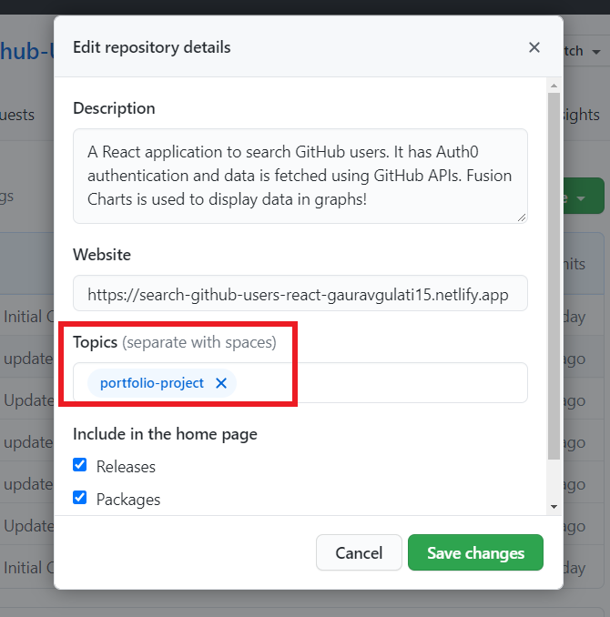
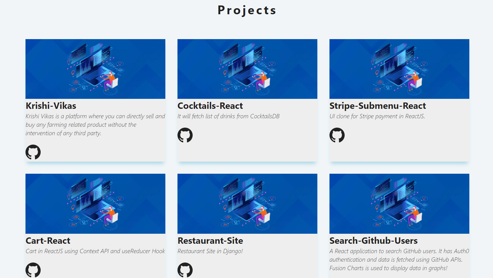

# **portfolio-project**

## Those days of manually updating portfolio website after every new project made are gone⚡

### **Yesss** . . . you read that right. 😉

## **_portfolio-project_** is a **_npm_** package to automatically update your projects section in your portfolio website. It will fetch the selected repositories directly from your GitHub account.

<hr>

### How to use it❓

### Add **_"portfolio-project"_** as a topic in the respository which you want to add in your portfolio. For example :-

<p align="center">
  
</p>

### Now you are good to go. 🚀

In your project folder, run this in terminal:

```
> npm install portfolio-project
```

Then in the file you want to get the projects :

```javascript
import getRepositories from "portfolio-project";

getRepositories("<Your-GitHub-Username>");
  .then(...)
  .catch(...);
```

### _getRepositories()_ will return a Promise.

### If that Promise is Resolved then it sends a JSON object containing the selected projects. For example :-

```JSON
[
    {
    name: "Krishi-Vikas",
    description:
      "Krishi Vikas is a platform where you can directly sell and buy any farming related product without the intervention of any third party.",
    topics: ["python", "bootstrap", "django", "portfolio-project"],
    repo_url: "https://github.com/gauravgulati15/KrishiVikas",
    deploy_url: "",
  },
  {
    name: "Search-Github-Users",
    description:
      "A React application to search GitHub users. It has Auth0 authentication and data is fetched using GitHub APIs. Fusion Charts is used to display data in graphs!",
    topics: ["javascript", "api", "reactjs", "portfolio-project"],
    repo_url: "https://github.com/gauravgulati15/Search-Github-Users",
    deploy_url: "https://search-github-users-react-gauravgulati15.netlify.app",
  },
  {
    name: "Cocktails-React",
    description: "It will fetch list of drinks from CocktailsDB",
    topics: ["api", "reactjs", "portfolio-project"],
    repo_url: "https://github.com/gauravgulati15/P10-CocktailsReact",
    deploy_url: "",
  },
]
```

- ### Note : If any repository does not have a deployed url set, then _deploy_url_ will return empty string and similar for other fields.

<br>

### Now you can use this data in your project!

### An example about how to use it in **React**.

<br>

In **_ProjectList.js_** file.

```javascript
import React from "react";
import Project from "./Project";
import getRepositories from "portfolio-project";

const ProjectList = () => {
  const [projects, setProjects] = React.useState([]);

  getRepositories("gauravgulati15")
    .then((result) => {
      setProjects(result);
    })
    .catch((error) => {
      console.log(error);
    });

  return (
    <section className="section">
      <h2 className="section-title">Projects</h2>
      <div className="projects-center">
        {projects.map((item) => {
          return <Project key={item.id} {...item} />;
        })}
      </div>
    </section>
  );
};

export default ProjectList;
```

<br>

In **_Project.js_** file.

```javascript
import React from "react";
const Project = ({ name, description, topics, repo_url, deploy_url }) => {
  return (
      // You can display as you like!
  );
};

export default Project;
```

For example :-

<p align="center">
  
</p>

## Try it in your Portfolios!

## **_If you like it give it a 🌟 and share it with your friends!💻_**
